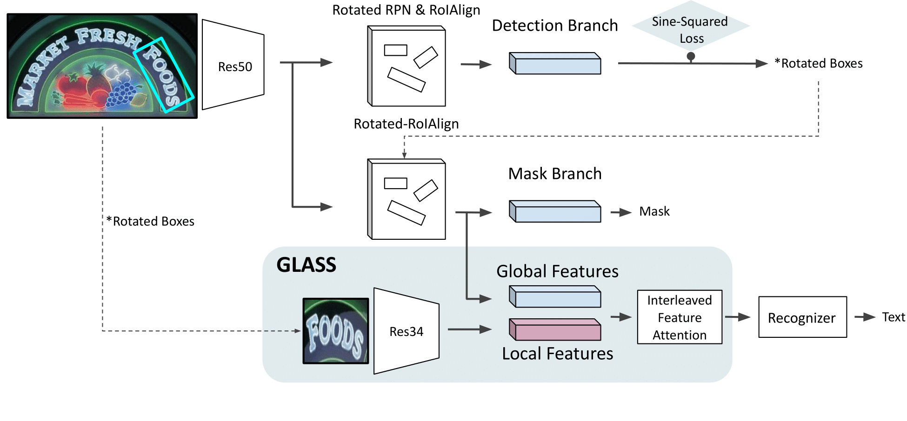
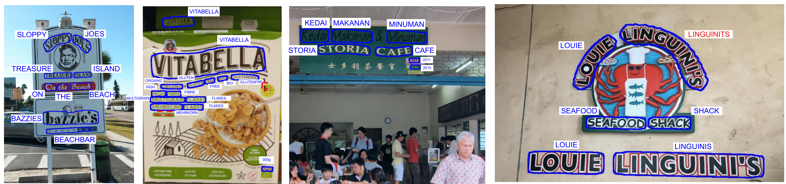

# GLASS: Global to Local Attention for Scene-Text Spotting


This is a PyTorch implementation of the following paper:

**GLASS: Global to Local Attention for Scene-Text Spotting**, ECCV 2022.

Roi Ronen, Shahar Tsiper, Oron Anschel, Inbal Lavi, Amir Markovitz and R. Manmatha.



**Abstract:**<br>
In recent years, the dominant paradigm for text spotting is to combine the tasks of text detection and recognition into a single end-to-end framework. 
Under this paradigm, both tasks are accomplished by operating over a shared global feature map extracted from the input image.
Among the main challenges end-to-end approaches face is the performance degradation when recognizing text across scale variations (smaller or larger text), and arbitrary word rotation angles.
In this work, we address these challenges by proposing a novel global-to-local attention mechanism for text spotting, termed GLASS, that fuses together global and local features.
The global features are extracted from the shared backbone, preserving contextual information from the entire image, while the local features are computed individually on resized, high resolution rotated word crops. 
The information extracted from the local crops alleviates much of the inherent difficulties with scale and word rotation.
We show a performance analysis across scales and angles, highlighting improvement over scale and angle extremities.
In addition, we introduce a periodic, orientation-aware loss term supervising the detection task, and show its contribution on both detection and recognition performance across all angles.
Finally, we show that GLASS is agnostic to architecture choice, and apply it to other leading text spotting algorithms, improving their text spotting performance.
Our method achieves state-of-the-art results on multiple benchmarks, including the newly released TextOCR.


**Result on Total-Text test dataset:**




## Installation
Compilation of this package requires Detectron2 ver.>=0.6 package. Installation has been tested on  Linux using using anaconda package management.

Clone the repository into your local machine
```
git clone https://github.com/amazon-research/glass-text-spotting
cd glass
```

Start a clean virtual environment and setup enviroment variables
```
conda create -n glass python=3.8
conda activate glass
```

Install required packages
```
pip install -e .
```

## Training

Pretraining on SynthText dataset
```
python ./tools/train_glass.py --datasets <path_to_SynthText_dataset> --output <output_path>
```

Fine-tuning the model
```
python ./tools/train_glass.py --datasets <path_to_dataset> --resume <pretrained_weights> --output <output_path>
```


### Datasets
This work supports the following datasets:

1. [SynthText](https://www.robots.ox.ac.uk/~vgg/data/scenetext/)
2. [ICDAR2013](https://rrc.cvc.uab.es/)
3. [ICDAR2015](https://rrc.cvc.uab.es/)
4. [Total-Text](https://www.robots.ox.ac.uk/~vgg/data/scenetext/)
5. [TextOCR](https://textvqa.org/textocr/dataset/)


## Citation
Please consider citing our work if you find it useful for your research.


## License

This project is licensed under the Apache-2.0 License.
